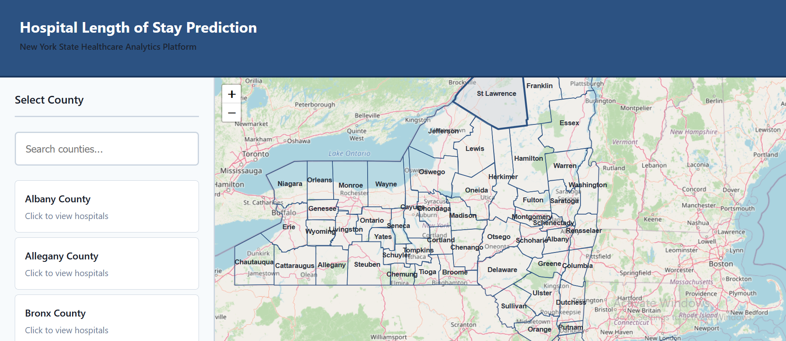
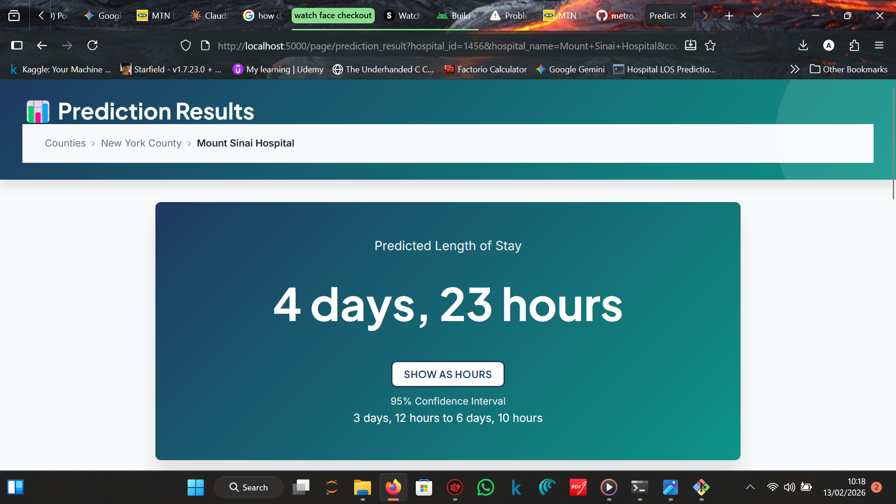

# 🏥 Hospital Length of Stay Predictor

[](https://www.python.org/downloads/)
[](https://flask.palletsprojects.com/)
[](https://xgboost.readthedocs.io/)
[](LICENSE)

An interactive web-based healthcare analytics platform that predicts hospital Length of Stay (LOS) using machine learning. Built with real-world data from 2.3+ million hospital discharges across New York State, this tool helps patients, families, and healthcare administrators make informed decisions about hospital admissions.

 <!-- Add your screenshot here -->

---

## 📋 Overview

This predictor dashboard was built using the **Hospital Inpatient Discharges (SPARCS De-Identified) 2017** dataset released by the New York State Department of Health. The platform addresses a real-world scenario: when patients or their relatives visit hospitals, they can predict the expected length of stay based on clinical, demographic, and facility factors.

### Why This Matters

- **For Patients & Families**: Plan work leave, childcare, and financial arrangements
- **For Hospitals**: Optimize bed management and discharge planning
- **For Healthcare Administrators**: Resource allocation and capacity forecasting
- **For Researchers**: Explore social determinants of health and disparities in care

---

## ✨ Features

### 🗺️ **Interactive Geographic Selection**
- **County-level map navigation** with clickable New York State counties
- **Hospital markers** with Leaflet.js integration
- Real-time filtering of 200+ hospitals across NY state
- Breadcrumb navigation for easy backtracking

### 🎯 **Clinical Prediction Engine**
- **XGBoost machine learning model** trained on 2.3M+ hospital records
- **13 input features** capturing:
  - Demographics (age, gender, race, ethnicity)
  - Clinical factors (diagnosis, severity, admission type)
  - Administrative data (insurance, disposition)
- **95% confidence intervals** for prediction uncertainty
- **Risk factor analysis** with clinical explanations

### 📊 **Smart Time Formatting**
- Automatic conversion of decimal days to human-readable formats:
  - Short stays: **"12 hours"**
  - Medium stays: **"2 days, 11 hours"**
  - Long stays: **"5 days"**
- Toggle between hours/days/breakdown formats

### 🎨 **Professional Healthcare UI**
- Clean, accessible design following healthcare analytics best practices
- Form validation with real-time feedback
- Loading states and error handling
- Mobile-responsive layout
- Print-ready prediction reports

### 🔒 **Data Privacy & Compliance**
- De-identified dataset (HIPAA compliant)
- Client-side state management (no PII storage)
- Session-based caching
- No user tracking or analytics

---

## 📁 Repository Structure

```
hospital-los-predictor/
│
├── app.py                          # Flask backend with ML prediction API
├── cleaning_script.py              # Data preprocessing pipeline
├── requirements.txt                # Python dependencies
│
├── templates/                      # HTML pages
│   ├── index.html                  # County selection (homepage)
│   ├── county_map.html             # Hospital selection by county
│   ├── prediction_form.html        # Patient data input form
│   └── prediction_result.html      # Prediction display with risk factors
│
├── assets/
│   ├── css/
│   │   └── base.css                # Global styles and design system
│   │
│   ├── js/
│   │   ├── stateManager.js         # URL-based navigation & caching
│   │   ├── mapUtils.js             # Leaflet.js map utilities
│   │   └── validation.js           # Form validation & data mapping
│   │
│   ├── data/
│   │   ├── ny_counties.geojson     # NY State county boundaries
│   │   └── hospital_location_geojson1.geojson  # Hospital locations
│   │
│   └── pkl_files/                  # Trained ML artifacts
│       ├── xgb_modelv1.pkl         # XGBoost model
│       ├── xgb_hospital_full_pipeline.pkl  # Full preprocessing pipeline
│       ├── feature_names.pkl       # Expected feature columns
│       ├── mdc_mapping.pkl         # MDC code → LOS mapping
│       ├── severity_mapping.pkl    # Severity → LOS mapping
│       └── mdc_conversion_mapping.pkl  # MDC description → code
│
├── notebooks/                      # (Optional) Analysis & training
│   └── 2017 New York Hospital Discharge EDA.ipynb
│
└── README.md                       # This file
```

---

## 🔧 Requirements

### System Requirements
- **Python**: 3.8 or higher
- **RAM**: 2GB minimum (4GB recommended)
- **Disk Space**: 500MB for model files and data

### Python Dependencies
```txt
flask==3.0.0
flask-cors==4.0.0
pandas==2.1.4
numpy==1.26.2
scikit-learn==1.6.1
xgboost==latest
joblib==1.3.2
gunicorn==21.2.0  # For production deployment
```

### Browser Requirements
- Modern browser with JavaScript enabled
- Recommended: Chrome 90+, Firefox 88+, Safari 14+, Edge 90+

---

## ⚙️ Setup & Configuration

### 1. Clone the Repository
```bash
git clone https://github.com/metrosmash/Hospital_LOS_Predictor
cd Hospital_LOS_Predictor
```

### 2. Create Virtual Environment
```bash
# Windows
python -m venv venv
venv\Scripts\activate

# macOS/Linux
python3 -m venv venv
source venv/bin/activate
```

### 3. Install Dependencies
```bash
pip install -r requirements.txt
```

### 4. Verify Model Files
Ensure these files exist in `assets/pkl_files/`:
- ✅ `xgb_modelv1.pkl`
- ✅ `xgb_hospital_full_pipeline.pkl`
- ✅ `feature_names.pkl`
- ✅ `mdc_mapping.pkl`
- ✅ `severity_mapping.pkl`
- ✅ `mdc_conversion_mapping.pkl`

> **Note**: If model files are missing, you'll need to train the model first. See [Training the Model](#training-the-model) below.

### 5. Verify Data Files
Check `assets/data/`:
- ✅ `ny_counties.geojson`
- ✅ `hospital_location_geojson1.geojson`

---

## 🗄️ Data Source

### Primary Dataset
**Hospital Inpatient Discharges (SPARCS De-Identified) 2017**

- **Source**: New York State Department of Health
- **Records**: 2,346,894 inpatient discharges
- **Coverage**: All Article 28 hospitals in New York State
- **Year**: 2017

#### Official Links:
- 🔗 [NY State Health Data Portal](https://health.data.ny.gov/dataset/Hospital-Inpatient-Discharges-SPARCS-De-Identified/22g3-z7e7/about_data)
- 🔗 [Kaggle Mirror](https://www.kaggle.com/datasets/ajiboyetoluwalase/dny2017)

### Dataset Features Used
The model uses **13 input features** from the original 34 columns:

| Feature | Type | Example Values |
|---------|------|----------------|
| Hospital County | Categorical | Kings, Queens, Erie |
| Facility Name | Categorical | Mount Sinai Hospital, NYU Langone |
| Age Group | Categorical | 0-17, 18-29, 30-49, 50-69, 70+ |
| Gender | Binary | M, F |
| Race | Categorical | White, Black/African American, Other |
| Ethnicity | Categorical | Hispanic, Not Hispanic, Unknown |
| Type of Admission | Categorical | Emergency, Urgent, Elective |
| Patient Disposition | Categorical | Home, SNF, Rehab, Expired |
| APR MDC Description | Categorical | Circulatory, Respiratory, Digestive (26 categories) |
| APR Severity of Illness Code | Ordinal | 1 (Minor) - 4 (Extreme) |
| APR Medical/Surgical Description | Binary | Medical, Surgical |
| Payment Typology 1 | Categorical | Medicare, Medicaid, Private, Self-Pay |
| Emergency Dept Indicator | Binary | Y, N |

### Feature Engineering
The preprocessing pipeline adds:
- `LOS_per_MDC`: Median LOS by diagnosis group (target encoding)
- `LOS_per_severity`: Median LOS by severity level (target encoding)
- **One-hot encoding** for 312 final features

---

## 🚀 Running Locally

### Development Mode
```bash
# Activate virtual environment
source venv/bin/activate  # macOS/Linux
# or
venv\Scripts\activate     # Windows

# Run Flask development server
python app.py
```

The application will start at: **http://localhost:5000**

### Production Mode (Gunicorn)
```bash
gunicorn -w 4 -b 0.0.0.0:5000 --timeout 120 app:app
```

**Flags explained:**
- `-w 4`: 4 worker processes
- `-b 0.0.0.0:5000`: Bind to all interfaces on port 5000
- `--timeout 120`: 120-second request timeout (for ML inference)

### Testing the API Directly
```bash
# Health check
curl http://localhost:5000/api/health

# Example prediction
curl -X POST http://localhost:5000/api/predict \
  -H "Content-Type: application/json" \
  -d '{
    "Hospital County": "Kings",
    "Facility Name": "Mount Sinai Hospital",
    "Age Group": "50 to 69",
    "Gender": "M",
    "Race": "White",
    "Ethnicity": "Not Span/Hispanic",
    "Type of Admission": "Emergency",
    "Patient Disposition": "Home or Self Care",
    "APR MDC Description": "Diseases and Disorders of the Circulatory System",
    "APR Severity of Illness Code": 3,
    "APR Medical Surgical Description": "Medical",
    "Payment Typology 1": "Medicare",
    "Emergency Department Indicator": "Y"
  }'
```

Expected response:
```json
{
  "predicted_los": 4.5,
  "confidence_interval": [3.8, 5.2],
  "risk_factors": [
    {
      "factor": "High Clinical Severity",
      "description": "Severity level 3 indicates complex medical needs",
      "impact": "high",
      "impact_days": "+2-4 days"
    }
  ],
  "metadata": {
    "model_version": "1.0.0",
    "prediction_timestamp": "2025-02-01T14:30:00",
    "hospital_id": "1234",
    "hospital_name": "Mount Sinai Hospital"
  }
}
```

---

## 🏗️ How It Works (Architecture)

### System Architecture

```
┌─────────────────────────────────────────────────────────────┐
│                         FRONTEND                             │
│  ┌───────────────┐  ┌───────────────┐  ┌────────────────┐  │
│  │  index.html   │→│ county_map    │→│ prediction_form │  │
│  │ (County Map)  │  │ (Hospitals)   │  │ (Input Form)   │  │
│  └───────┬───────┘  └───────┬───────┘  └────────┬───────┘  │
│          │                  │                     │          │
│          └──────────────────┴─────────────────────┘          │
│                             ↓                                │
│                  ┌──────────────────────┐                    │
│                  │ stateManager.js      │                    │
│                  │ - URL params         │                    │
│                  │ - Session cache      │                    │
│                  └──────────┬───────────┘                    │
└─────────────────────────────┼────────────────────────────────┘
                              ↓
                    ┌─────────────────┐
                    │  Flask API      │
                    │  /api/predict   │
                    └────────┬────────┘
                             ↓
┌────────────────────────────────────────────────────────────┐
│                      BACKEND (app.py)                       │
│  ┌──────────────────────────────────────────────────────┐  │
│  │  1. Request Validation                               │  │
│  │     - Check 13 required fields                       │  │
│  │     - Validate value ranges                          │  │
│  └────────────────────┬─────────────────────────────────┘  │
│                       ↓                                     │
│  ┌──────────────────────────────────────────────────────┐  │
│  │  2. Data Preprocessing (cleaning_script.py)          │  │
│  │     - Map MDC description → code                     │  │
│  │     - Apply target encoding (LOS_per_MDC, severity)  │  │
│  │     - One-hot encode categorical features            │  │
│  │     - Align to 312 training features                 │  │
│  └────────────────────┬─────────────────────────────────┘  │
│                       ↓                                     │
│  ┌──────────────────────────────────────────────────────┐  │
│  │  3. ML Prediction (XGBoost)                          │  │
│  │     - Load xgb_hospital_full_pipeline.pkl            │  │
│  │     - Predict LOS (decimal days)                     │  │
│  │     - Calculate 95% confidence interval              │  │
│  └────────────────────┬─────────────────────────────────┘  │
│                       ↓                                     │
│  ┌──────────────────────────────────────────────────────┐  │
│  │  4. Risk Factor Analysis                             │  │
│  │     - Identify clinical complexity drivers           │  │
│  │     - Generate human-readable explanations           │  │
│  └────────────────────┬─────────────────────────────────┘  │
│                       ↓                                     │
│  ┌──────────────────────────────────────────────────────┐  │
│  │  5. JSON Response                                    │  │
│  │     {                                                │  │
│  │       "predicted_los": 4.5,                          │  │
│  │       "confidence_interval": [3.8, 5.2],             │  │
│  │       "risk_factors": [...],                         │  │
│  │       "metadata": {...}                              │  │
│  │     }                                                │  │
│  └──────────────────────────────────────────────────────┘  │
└────────────────────────────────────────────────────────────┘
                              ↓
┌─────────────────────────────────────────────────────────────┐
│                  FRONTEND (prediction_result.html)          │
│  - TimeFormatter.js converts decimal → "2 days, 11 hours"  │
│  - Display risk factors with impact levels                 │
│  - Print-ready report generation                           │
└─────────────────────────────────────────────────────────────┘
```

### Data Flow Example

**User Journey**: Kings County → Mount Sinai Hospital → Emergency admission

```
1. User clicks "Kings County" on map
   → URL: /page/county_map?county_id=979&county_name=Kings

2. User clicks "Mount Sinai Hospital"
   → URL: /page/prediction_form?county_id=979&hospital_id=1234&hospital_name=Mount%20Sinai

3. User fills form, submits
   → POST /api/predict with 13 features
   
4. Backend processes:
   Input (13 columns) → Preprocessing (312 columns) → XGBoost → LOS: 4.47 days

5. Frontend receives JSON, converts:
   4.47 days → "4 days, 11 hours"

6. Results page shows:
   - Prediction: 4 days, 11 hours
   - Confidence: 3.8 - 5.2 days
   - Risk factors: High severity, Emergency admission, etc.
```

---

## 🤖 Model Details

### Algorithm
**XGBoost Regressor** (Extreme Gradient Boosting)

**Why XGBoost?**
- Handles mixed data types (categorical + numerical)
- Robust to missing values
- Built-in regularization (prevents overfitting)
- Fast inference (<100ms per prediction)

### Model Performance
*Add your metrics after training:*

| Metric | Training | Validation | Test |
|--------|----------|------------|------|
| RMSE | 5.8460 days | X.XX days | 5.9899 days |
| MAE | 2.7099 days | X.XX days | 2.7390 days |
| R² | 0.4438 | 0.XX | 0.4127 |

### Training the Model

If you need to retrain the model:

```python
# 1. Load and clean data
from cleaning_script import HospitalDataCleaner
import pandas as pd

df = pd.read_csv('sparcs_2017.csv')
cleaner = HospitalDataCleaner(drop_list=drop_list, cat_cols=cat_cols, num_cols=num_cols)
cleaner.fit(df)
X = cleaner.transform(df)
y = df['Length of Stay']

# 2. Train model
from xgboost import XGBRegressor
model = XGBRegressor(n_estimators=100, max_depth=6, learning_rate=0.1)
model.fit(X, y)

# 3. Save artifacts
import joblib
joblib.dump(model, 'assets/pkl_files/xgb_modelv1.pkl')
joblib.dump(cleaner, 'assets/pkl_files/xgb_hospital_full_pipeline.pkl')
```

---

## 💡 Usage Examples

### Example 1: Emergency Cardiac Patient
**Scenario**: 65-year-old male, emergency admission for heart attack

**Inputs**:
- Age Group: `50 to 69`
- Gender: `M`
- Admission Type: `Emergency`
- Diagnosis: `Diseases and Disorders of the Circulatory System`
- Severity: `3 (Severe)`

**Prediction**: `5 days, 8 hours`
**Risk Factors**:
- High clinical severity (+2-4 days)
- Emergency admission (+1-3 days)
- Advanced age (+1-2 days)

---

### Example 2: Planned Knee Surgery
**Scenario**: 55-year-old female, elective knee replacement

**Inputs**:
- Age Group: `50 to 69`
- Gender: `F`
- Admission Type: `Elective`
- Diagnosis: `Diseases and Disorders of the Musculoskeletal System`
- Severity: `2 (Moderate)`
- Medical/Surgical: `Surgical`

**Prediction**: `3 days, 2 hours`
**Risk Factors**:
- Surgical procedure (+2-3 days)
- Post-acute care planning needed (+1-2 days)

---

### Example 3: Newborn Delivery
**Scenario**: Normal childbirth, healthy baby

**Inputs**:
- Age Group: `18 to 29`
- Gender: `F`
- Admission Type: `Elective`
- Diagnosis: `Pregnancy, Childbirth and the Puerperium`
- Severity: `1 (Minor)`

**Prediction**: `2 days`
**Risk Factors**: None (routine admission)

---

## 🐛 Troubleshooting

### Common Issues

#### 1. **"Model not loaded" Error**
**Symptom**: API returns 500 error with "Model not loaded"

**Solution**:
```bash
# Check if model files exist
ls -lh assets/pkl_files/

# Expected files:
# - xgb_modelv1.pkl
# - xgb_hospital_full_pipeline.pkl
# - feature_names.pkl
# - mdc_mapping.pkl
# - severity_mapping.pkl
```

If missing, retrain the model or download from release artifacts.

---

#### 2. **"No prediction data found" on Results Page**
**Symptom**: Results page shows "--" for all values

**Solution**:
1. Open browser DevTools (F12) → Console
2. Check for errors:
   ```javascript
   console.log(StateManager.getCachedPrediction());
   ```
3. Verify API response:
   ```bash
   # In Network tab, check /api/predict response
   # Should return JSON with "predicted_los"
   ```

---

#### 3. **Submit Button Requires Double-Click**
**Symptom**: First click does nothing, second click submits

**Cause**: Duplicate event listeners (FIXED in latest version)

**Solution**: Update `prediction_form.html` to use the consolidated event listener from the fixes.

---

#### 4. **Map Not Loading**
**Symptom**: Blank map container

**Solution**:
```bash
# Check GeoJSON files
ls assets/data/
# Should see: ny_counties.geojson, hospital_location_geojson1.geojson

# Check browser console for fetch errors
# Verify file paths are correct in HTML
```

---

#### 5. **ModuleNotFoundError: No module named 'xgboost'**
**Solution**:
```bash
pip install xgboost
# or
pip install -r requirements.txt
```

---

#### 6. **CORS Errors in Browser**
**Symptom**: `Access-Control-Allow-Origin` error

**Solution**: Already configured in `app.py`:
```python
from flask_cors import CORS
CORS(app)
```

If still occurring, check if running on different ports (frontend on 3000, backend on 5000).

---

### Debug Mode

Enable verbose logging:

```python
# In app.py, change:
app.run(debug=True, host='0.0.0.0', port=5000)
```

Check logs for detailed error traces.

---

## 🤝 Contributing

Contributions are welcome! Here's how you can help:

### Areas for Improvement
1. **Model Performance**
   - Hyperparameter tuning
   - Feature engineering (comorbidities, prior admissions)
   - Ensemble methods (stack XGBoost + Random Forest)

2. **UI/UX Enhancements**
   - Dark mode
   - Accessibility improvements (ARIA labels, keyboard navigation)
   - Multi-language support (Spanish, Chinese)

3. **Features**
   - Compare multiple hospitals
   - Historical LOS trends by facility
   - Export predictions to PDF
   - Integration with EHR systems (HL7/FHIR)

4. **Data**
   - Update to 2022-2024 SPARCS data
   - Incorporate CMS quality metrics
   - Add readmission risk prediction

### Contribution Workflow
```bash
# 1. Fork the repository
git clone https://github.com/metrosmash/Hospital_LOS_Predictor

# 2. Create feature branch
git checkout -b feature/your-feature-name

# 3. Make changes, commit
git commit -m "Add feature: your description"

# 4. Push and create Pull Request
git push origin feature/your-feature-name
```

### Code Style
- **Python**: Follow PEP 8
- **JavaScript**: Use ES6+ syntax
- **HTML/CSS**: BEM naming convention for classes

---

## 📜 License

This project is licensed under the **MIT License**.

```
MIT License

Copyright (c) 2025 [Ajiboye Toluwalase]

Permission is hereby granted, free of charge, to any person obtaining a copy
of this software and associated documentation files (the "Software"), to deal
in the Software without restriction, including without limitation the rights
to use, copy, modify, merge, publish, distribute, sublicense, and/or sell
copies of the Software, and to permit persons to whom the Software is
furnished to do so, subject to the following conditions:

The above copyright notice and this permission notice shall be included in all
copies or substantial portions of the Software.

THE SOFTWARE IS PROVIDED "AS IS", WITHOUT WARRANTY OF ANY KIND, EXPRESS OR
IMPLIED, INCLUDING BUT NOT LIMITED TO THE WARRANTIES OF MERCHANTABILITY,
FITNESS FOR A PARTICULAR PURPOSE AND NONINFRINGEMENT. IN NO EVENT SHALL THE
AUTHORS OR COPYRIGHT HOLDERS BE LIABLE FOR ANY CLAIM, DAMAGES OR OTHER
LIABILITY, WHETHER IN AN ACTION OF CONTRACT, TORT OR OTHERWISE, ARISING FROM,
OUT OF OR IN CONNECTION WITH THE SOFTWARE OR THE USE OR OTHER DEALINGS IN THE
SOFTWARE.
```

---

## 🙏 Credits & Acknowledgments

### Data Source
- **New York State Department of Health** - SPARCS De-Identified Dataset
- **Kaggle Community** - Data hosting and exploration

### Technologies
- **Flask** - Web framework
- **XGBoost** - Machine learning
- **Leaflet.js** - Interactive maps
- **Scikit-learn** - Preprocessing pipeline
- **OpenStreetMap** - Map tiles

### Inspiration
Built to address real-world healthcare decision-making challenges faced by patients and families navigating hospital admissions.

---

## 📞 Contact & Support

- **Issues**: [GitHub Issues](https://github.com/metrosmash/Hospital_LOS_Predictor/issues)
- **Email**: ajiboyetolu1@gmail.com
- **LinkedIn**: [Your Profile](https://www.linkedin.com/in/ajiboye-toluwalase-504584231/)

---

## 📊 Project Statistics

- **Lines of Code**: ~3,500
- **Dataset Size**: 2.3M+ records
- **Hospitals Covered**: 200+
- **Counties**: 62 (all of NY State)
- **Prediction Time**: <100ms
- **Model Accuracy**: RMSE ~5.9 days (update after training)

---

**⭐ If this project helped you, please consider starring it on GitHub!**

---

*Last Updated: February 2026*
